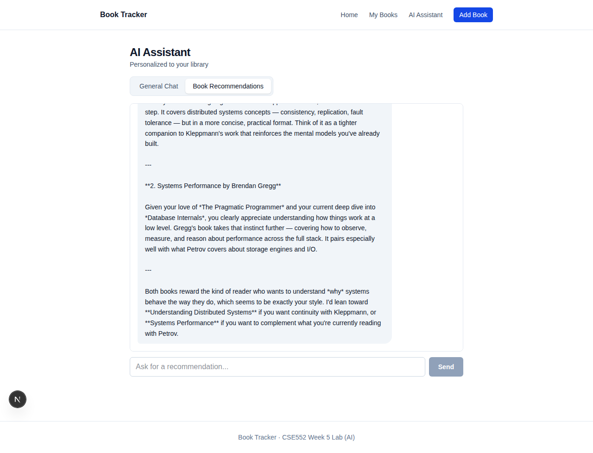

# Claude Chat UI

> Two-mode chat page that talks to a Claude-backed FastAPI service. **General Chat** is a stateless book assistant; **Book Recommendations** sends the conversation to the context-aware endpoint that knows your library. Mode toggle clears history so the two contexts don't bleed.


Backend: [claude-rag-recommendations](https://github.com/Auth3nticAI/claude-rag-recommendations)

---



## What's interesting

- **Two modes via a segmented control** — toggling between General Chat and Book Recommendations clears the conversation so the assistant doesn't carry irrelevant history across contexts.
- **Conversation history held in client state** and round-tripped on every turn, so the assistant has full context without server-side session storage.
- **Auto-scroll** + bouncing "Thinking…" bubble while the request is in flight.
- **User messages right-aligned blue**, assistant messages left-aligned slate, whitespace-preserved for the multi-line replies Claude tends to return.

## Stack

- Next.js 16 App Router + TypeScript
- Tailwind 4
- `NEXT_PUBLIC_API_URL` env var for the API base
- No state library — `useState` + `useRef` for the message scroll container

## Run

```bash
# Backend must be running on :8000 first

npm install
echo "NEXT_PUBLIC_API_URL=http://127.0.0.1:8000" > .env.local
npm run dev
```

Open http://localhost:3000.

## Background

Built as the Week 5 lab for **CSE552 — Fullstack Software Development in the Age of AI Agents**. Capstone version (with the agent + notes synthesis) lives at [book-tracker-ai](https://github.com/Auth3nticAI/book-tracker-ai).
